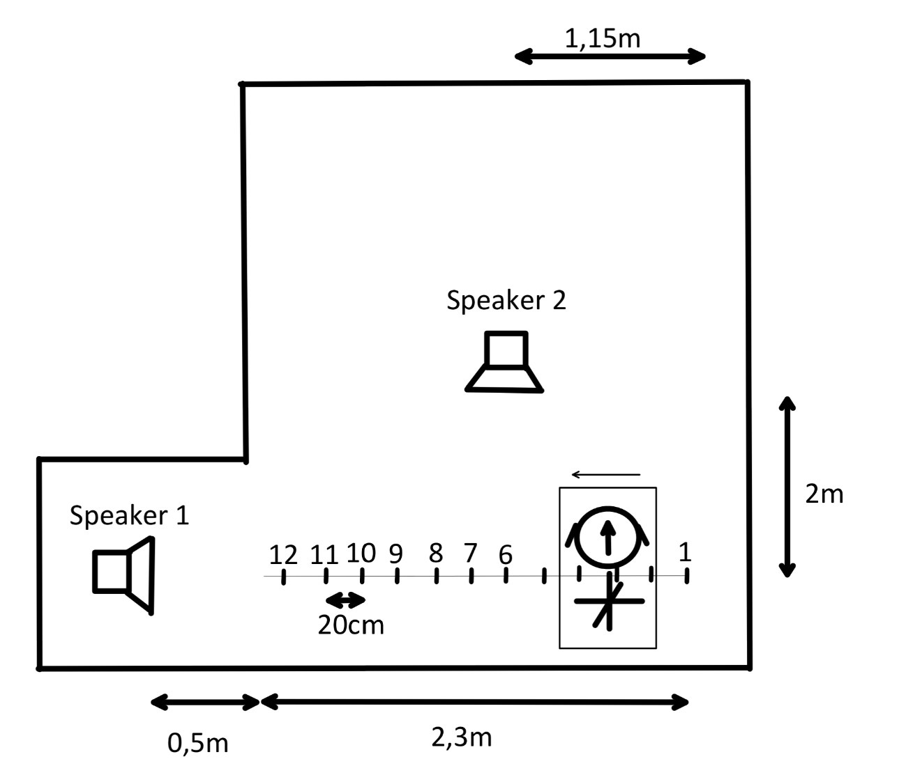
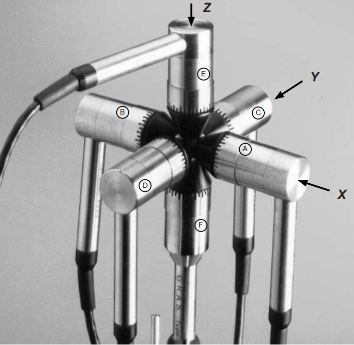
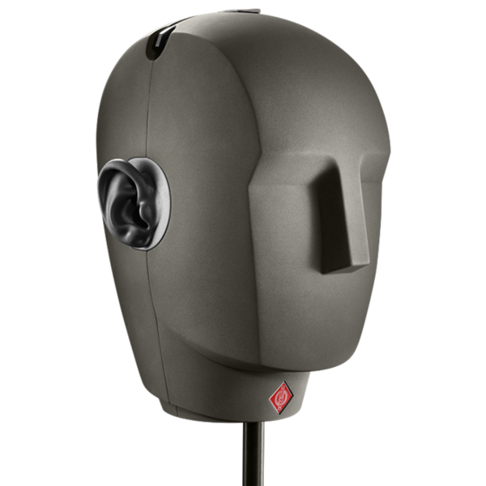

## [Dataset](Dataset)
- #### [Discrete_measurements](../Dataset/Discrete_measurements)
Contains 24 directories, 12 directories for each position with speaker 1 and 12 directories for each position with speaker 2, 'speakerX_posY'. 
Each of these directories contain the 6 measurements (wav and pkf) corresponding to each mic of the vector probe (A till F).
- #### [Continuous_measurements](../Dataset/Continuous_measurements)
Contains the used sound file ([sound_file.wav](../Dataset/Continuous_measurements/sound_file.wav)) and 2 directories 'speakerX_continuous' containing the wav, csv and xlsx files of the measurement for speaker 1 and 2. The latter files hold the times,positions and speeds data.

## MEASUREMENTS SETUP
The figure below displays the measurements setup. Two speakers and a railway are used, on the railway a cart is placed with the Neumann KU 100 dummy head and the GRAS 50VI-1 Vector intensity probe ontop of it. Speaker 1 is placed 0,5m away from the end of the railway, facing in the direction of the railway. Speaker 2 is positioned perpendicular to the railway. It is placed in the middle of the railway and 2m from it. 

### Discrete measurements
- For the discrete measurements (see [Discrete_measurements](../Dataset/Discrete_measurements)), the cart was placed on discrete positions on the railway, going from 0m to 2.2m from the right side, indicated by number 1 till 12. Each position is 20cm apart, therefore a small spatial resolution was obtained. In these measurements, the speaker emitted an exponential sine sweep (ESS), as of Farina’s formulation, to be later converted to RIRs. These were recorded by the microphone array, so 6x12x2 (6 mics, 12 positions for 2 speakers) measurements. 

### Continuous measurements
- For the continuous measurement see [Continuous_measurements](../Dataset/Continuous_measurements), both the head and vector probe microphones were used. In this case the cart was moving from position 1 to position 12 at a speed of 1km/h. This was also done by speaker 1 and speaker 2 separately, therefore four measurements were obtained. 

To clarify, the microphone array consisted of six microphones, in each direction one, so for each measurement of the microphone array, there are actually six measurements. The head consists of two microphones, one for the left and one for the right ear, so for every measurement for the head, there are actually two measurements. 
Be aware that the microphone array and head are placed above eachother, for visualisation reasons they are placed in front of eachother.

<!--  -->

  
  
Figure 1: Measurement Setup

  
  
  
Figure 2: GRAS 50VI-1 Vector intensity probe and Neumann KU 100 dummy head

## Sources
- Farina, A. (2000). Simultaneous measurement of impulse re-sponse and distortion with a swept-sine technique. Journal of The Audio Engineering Society.
- Farina, A. (2007). Advancements in impulse response measurements by sine sweeps. Journal of The Audio EngineeringSociety.
- GRAS (2014). Instruction manual vector intensity probe type 50vi-1 (wide-band intensity probe type 50vi-3). GRAS https://www.grasacoustics.com/files/m/a/man_50VI-1.pdf
- Neumann, G. (2020). Operating instructions ku 100. Neumann https://www.neumann.com/en-en/file-finder/?productName=KU+100